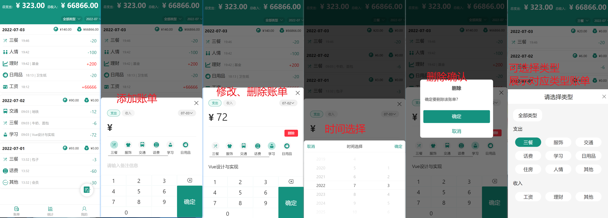

my-diary

基于 React 实现的个人记账本

根据[Node + React 实战：从 0 到 1 实现记账本小测](https://juejin.cn/book/6966551262766563328)实现的个人记账本

前端：react、react-router、ant-design-mobile、axios

后端：egg-jwt、egg-cors、egg-mysql

登陆流程：登陆成功之后，通过 egg-jwt + secret，即 jwt.sign({id, username,exp},secret) 生成 token；登陆成功后将返回的 token 存储到 localStorage 中；通过 axios 请求后端接口，并通过 axios.defaults.headers['Authorization'] 将 token 放入其 Authorization 字段中

前端请求后端流程：请求后端 API 时，后端通过请求头中的 Authorization 字段获取前端的 token 信息，并使用 jwt.verify(token,secret) 对其进行 decode，通过 decode 内的 username 获取到数据库中的个人数据信息，并通过 id 操作其他数据。如果请求头中的 Authorization 字段为 null，通过中间件的拦截，返回401，axios接受到401，将会跳转到登陆页面。

文件上传：通过 readFileSync，writeFileSync的方式读取和写入文件，写入路径获取方式为：path.join(uploadDir, moment(new Date()).format('YYYYMMDD'), Date.now, path.extname(file.filename))，即 public/upload/日期/时间.jpg

